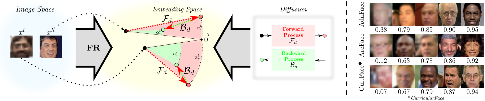
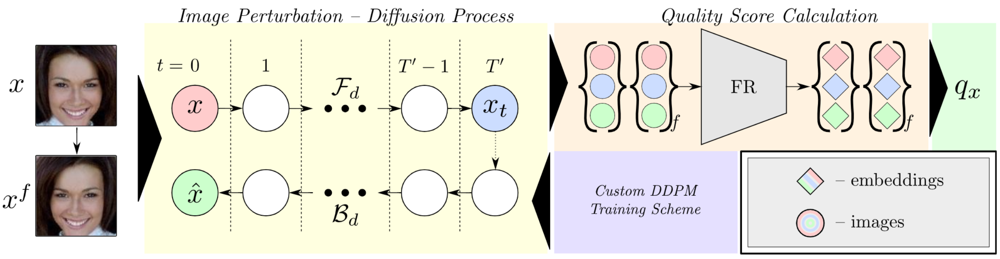
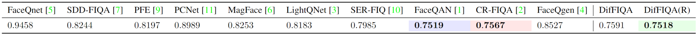
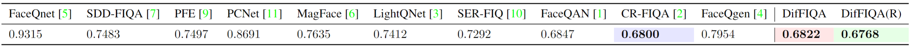
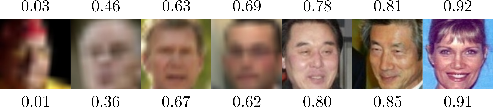

# __[DifFIQA: Face Image Quality Assessment Using Denoising Diffusion Probabilistic Models](https://arxiv.org/abs/2305.05768)__ _(Official Repository)_

- Official repository of the paper [DifFIQA: Face Image Quality Assessment Using Denoising Diffusion Probabilistic Models](https://arxiv.org/abs/2305.05768) in proceedings of IEEE International Joint Conference on Biometrics (IJCB) 2023. 

___

## __Table of Contents__

  - [**1. Paper overview**](#1-paper-overview)
    - [**Abstract**](#abstract)
    - [**Idea and Overview**](#idea_and_overview)
    - [**Results**](#results)

  - [**2. Use of repository**](#2-use-of-repository)
    - [**2.1. Environment setup**](#21-environment-setup)

  - [**3. Citation**](#3-citation)

___

## __1. Paper Overview__

### __Abstract__

Modern face recognition (FR) models excel in constrained scenarios, but often suffer from decreased performance when deployed in unconstrained (real-world) environments due to uncertainties surrounding the quality of the captured facial data. Face image quality assessment (FIQA) techniques aim to mitigate these performance degradations by providing FR models with sample-quality predictions that can be used to reject low-quality samples and reduce false match errors. However, despite steady improvements, ensuring reliable quality estimates across facial images with diverse characteristics remains challenging. In this paper, we present a powerful new FIQA approach, named DifFIQA, which relies on  denoising diffusion probabilistic models (DDPM) and ensures highly competitive results. The main idea behind the approach is to utilize the forward and backward processes of DDPMs to perturb facial images and quantify the impact of these perturbations on the corresponding image embeddings for quality prediction. Because the diffusion-based perturbations are computationally expensive, we also distill the knowledge encoded in DifFIQA into a regression-based quality predictor, called DifFIQA(R), that balances performance and execution time. We evaluate both models in comprehensive experiments on 7 diverse datasets, with 4 target FR models and against 10 state-of-the-art FIQA techniques with highly encouraging results

### __Idea and Overview__



__High-level idea behind the proposed DifFIQA face image quality assessment (FIQA) approach.__ The quality of face images corresponds to a considerable degree to the stability of the respective representations in the embedding space of a given face recognition (FR) model. DifFIQA utilizes a diffusion framework to explore the embedding stability through image perturbations caused by the noising and denoising processes. The intuition behind this approach is that the forward (noising) $\mathcal{F}_d$ and backward (denoising) $\mathcal{B}_d$  diffusion processes lead to larger embedding perturbations for lower-quality images ($x^l$) compared to facial images of higher quality ($x^h$). By analyzing the impact of both the forward and backward processes on the representation of a given image, DifFIQA is able to infer the corresponding quality and/or generate (FR model specific) quality rankings, as shown on the right.



__Overview of DifFIQA.__ The proposed quality assessment pipeline consists of two main parts: the _Diffusion Process_ and the _Quality-Score Calculation_. The diffusion process uses an encoder-decoder UNet model ($D$), trained using an extended DDPM training scheme that helps to generate higher-quality (restored) images. The custom DDPM model is used in the Diffusion Process, which generates noisy $x_t$ and reconstructed $\hat{x}$ images using the forward and backward diffusion processes, respectively. To capture the effect of facial pose on the quality estimation procedure, the process is repeated with a horizontally flipped image $x^f$. The Quality Score Calculation part then produces and compares the embeddings of the original images and the images generated by the diffusion part.

### __Results__


__Comparison to the state-of-the-art in the form of (non-interpolated) EDC curves.__ Results are presented for seven diverse datasets, four FR models and in comparison to ten recent FIQA competitors. Observe how the distilled model performs comparably to the non-distilled version, especially at low discard rates. DifFIQA and DifFIQA(R) most convincingly outperform the competitors on the most challenging IJB-C and XQLFW datasets.




__Average performance over all seven test datasets and four FR models at a drop rate of $\mathbf{0.2}$.__ The results are reported in terms of average pAUC score at the FMR of $10^{-3}$. The proposed DifFIQA(R) approach is overall the best performer. The best result is colored green, the second-best blue and the third-best red.



__Average performance over all seven test datasets and four FR models at a drop rate of $\mathbf{0.3}$.__ The results are reported in terms of average pAUC score at the FMR of $10^{-3}$. The proposed DifFIQA(R) approach is overall the best performer. The best result is colored green, the second-best blue and the third-best red.


 

__Illustration of the quality scores produced by the proposed FIQA techniques.__ The scores on the top shows results for DifFIQA and the scores at the bottom for DifFIQA(R). While the concrete scores differ, both models generate similar rankings.

---

## __2. Use of repository__

- This repository consists of two main parts:
    - __[DifFIQA codebase](./diffiqa)__: _Contains training and inference code for the base DifFIQA method as well as the pretrained model weights._
    - __[DifFIQA(R) codebase](./diffiqa(r))__: _Contains training and inference code for the extended DifFIQA regressor as well as the pretrained model weights._

- Detailed instructions on how to setup and use both methods are included in each respective _README file_.


### __2.1. Environment setup__

__We recommend using conda to setup the environment.__

- Create and activate a new conda environment:
  > conda create -n diffiqa_r python=3.10

  > conda activate diffiqa_r

- Install PyTorch (use appropriate version of CUDA):
  > conda install pytorch torchvision torchaudio pytorch-cuda=11.7 -c pytorch -c nvidia

- Install necessary Python libraries:
  > accelerate, numpy, scipy, pillow, tqdm, wandb, einops

- Using pip install also:
  > pip install opencv-python
  
  > pip install ema-pytorch


##  __3. Citation__

If you find this repository useful, please cite the following paper:

``` 
 @inproceedings{babnikIJCB2023,
  title={{DifFIQA: Face Image Quality Assessment Using Denoising Diffusion Probabilistic Models}},
  author={Babnik, {\v{Z}}iga and Peer, Peter and {\v{S}}truc, Vitomir},
  booktitle={Proceedings of the IEEE International Joint Conference on Biometrics (IJCB)},
  year={2023},
}
``` 